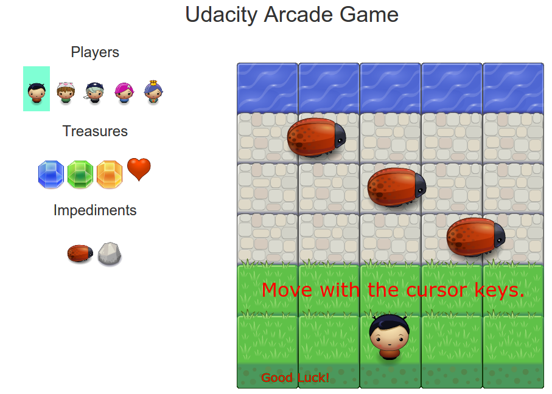
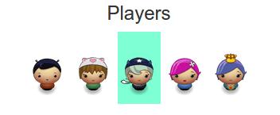
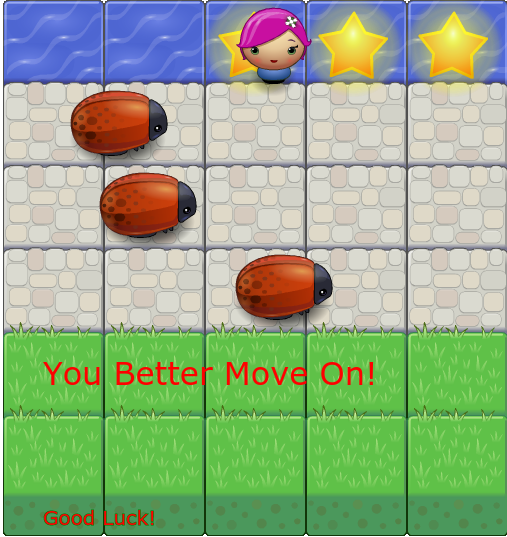
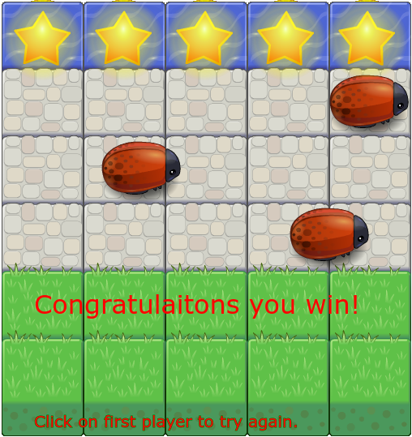
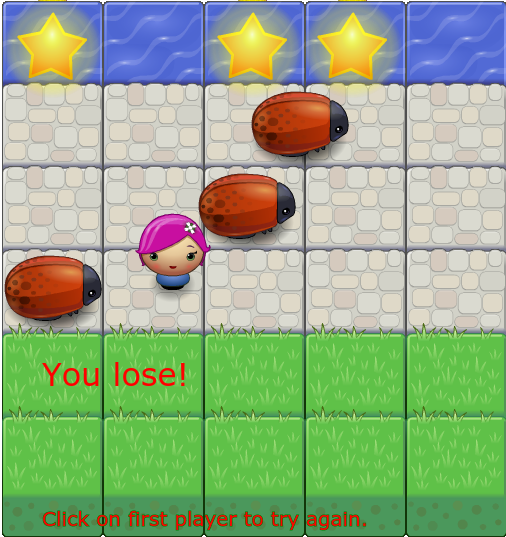

Udacity frontend-nanodegree-arcade-game
=======================================

### Goal of the Project Number 3

Practice the two Udacity courses

* [Object-Oriented Javascript](https://www.udacity.com/course/ud015)
* [HTML5 Canvas](https://www.udacity.com/course/ud292)

### Additional Personal Goals
* Use some Twitter Bootstrap from the previous couse.
* Use some jQuery form the prevoius couse.

### The game

 * The goal of my game is to bring the five players to the upper water line of the game 
   without colliding with a running enemy. 
 * The enemies run with different speed.
 * If all 5 players reach the goal line the game is won.
 * For every player reaching the goal, the speed of the enemies will be encreased.

 

#### Additional description

 * The active player is highlighted on the left.
 

 * For each player reaching the upper border, a star will be displayed.
 * Only one star may be won per column. If a player try to reach the water line where already a star is, the message "You better move on!" will be displayed.
 * If all five players reach the water line, five stars will be display and the message "Congratulation the you win!".
 * If a player collides with an enemy, the game is lost and the message "You loose!" will be displayed.
 * To restart the game, click the the first player of the Players list.
 * Treasures are not used within the game.

 
<table style="border=50">
    <tr>
        <td></td>
        <td></td>
        <td></td>
    </tr>
</table>

### Corresponding Udacity Courses

* [Object-Oriented Javascript](https://www.udacity.com/course/ud015)
* [HTML5 Canvas](https://www.udacity.com/course/ud292)

* [Self-checking](https://www.udacity.com/course/viewer#!/c-ud015/l-3072058665/m-3072588797) of the submission

### References

* [Udacity Style Guide](http://udacity.github.io/frontend-nanodegree-styleguide/javascript.html)
* [Eloquent Javascript](http://eloquentjavascript.net/)
* [JavaScript: The Good Parts](http://shop.oreilly.com/product/9780596517748.do)
* [MDN JavaScript reference](https://developer.mozilla.org/en-US/docs/Web/JavaScript/Reference)
* [jQuery API documentation](http://api.jquery.com/)

